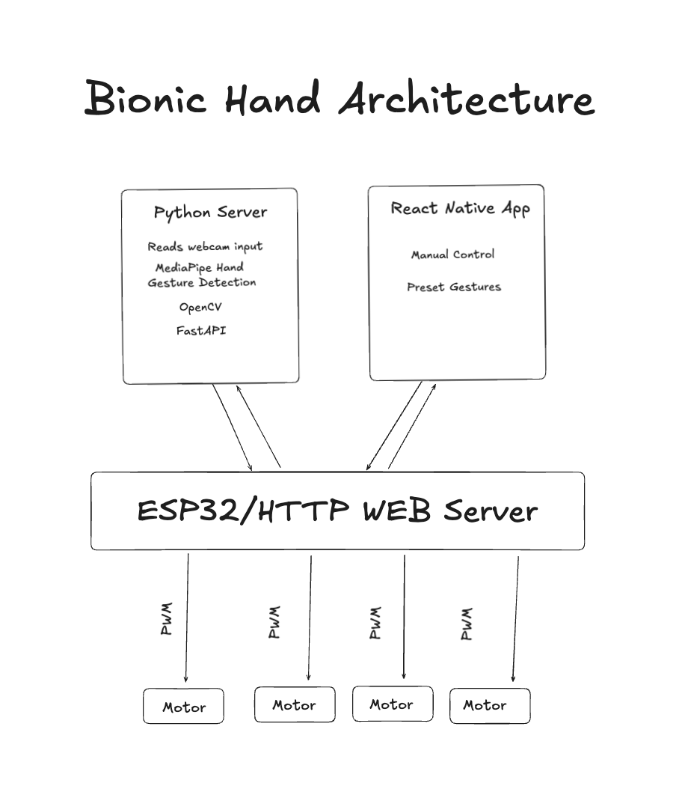

# 🤖 Bionic Hand Project

A real-time gesture-controlled bionic hand system that uses computer vision to track hand movements and replicate them on a physical robotic hand via servo motors.


## 📋 Table of Contents

- [Overview](#overview)
- [Video Gallery](#-video-gallery)
- [Features](#-features)
- [System Architecture](#️-system-architecture)
- [Hardware Components](#-hardware-components)
- [Software Stack](#-software-stack)
- [Setup & Installation](#-setup--installation)
- [Usage](#-usage)
- [Development Progress](#-development-progress)
- [Future Improvements](#-future-improvements)

## 🎬 Video Gallery

| Demo | Description |
|------|-------------|
| [Finger_V1_Test.MP4](docs/media/Finger_V1_Test.MP4) | Initial single-finger prototype test |
| [One_Finger_Hand_Gesture_Grip.MOV](docs/media/One_Finger_Hand_Gesture_Grip.MOV) | Hand gesture controlling grip motion |
| [Two_Finger_App_Control.MOV](docs/media/Two_Finger_App_Control.MOV) | Mobile app slider control demonstration |
| [Two_Finger_Hand_Detection.MOV](docs/media/Two_Finger_Hand_Detection.MOV) | Real-time hand tracking with two fingers |

## 🎯 Overview

This project combines computer vision, embedded systems, and mobile development to create a bionic hand that mimics real hand movements in real-time. Using MediaPipe for hand landmark detection, the system processes webcam input to calculate finger curl values and transmits servo angles to an ESP32-controlled robotic hand.

The system supports two control modes:
1. **Gesture Control**: Real-time hand tracking via webcam
2. **Manual Control**: Direct finger control via React Native mobile app

## ✨ Features

- **Real-time Hand Tracking**: Uses MediaPipe to detect 21 hand landmarks with high accuracy
- **Gesture Recognition**: Calculates finger curl values (0-1) for index, middle, ring, and pinky fingers
- **Wireless Control**: HTTP-based communication between Python server and ESP32
- **Mobile App Control**: React Native app for manual finger control and preset gestures
- **Smooth Motion**: EMA smoothing and threshold filtering to prevent jittery servo movements
- **Video Streaming**: FastAPI server streams processed video with landmark overlays
- **Multiple Control Modes**:
  - Live gesture mirroring via webcam
  - Manual control via mobile app
  - Preset hand positions

## 🏗️ System Architecture



The system consists of three main components:

### 1. Python Server
- Captures webcam input using OpenCV
- Processes hand landmarks with MediaPipe
- Calculates finger curl values (0-1 normalized)
- Maps curl to servo angles (0-180°)
- Streams video feed via FastAPI
- Sends HTTP commands to ESP32

### 2. ESP32 Microcontroller
- Receives servo angle commands via WiFi
- Controls 4 SG90 servo motors via PWM
- Exposes HTTP endpoints for control and status
- Returns current servo positions

### 3. React Native Mobile App
- Provides manual control via sliders
- Includes preset gesture buttons
- Displays real-time servo positions
- Communicates with ESP32 over HTTP


## 🔧 Hardware Components

### 3D Printed Parts

*All four finger mechanisms fresh off the 3D printer*

The bionic hand uses custom 3D printed finger mechanisms designed to articulate with servo motor control. Each finger has:
- Articulated joints for realistic movement
- Tendon channels for fishing line
- Servo mount points
- Lightweight PLA construction

### Electronics
- **ESP32-S3 DevKit** - Main microcontroller with WiFi capability
- **4x SG90 Servo Motors** - 9g micro servos for finger actuation
- **5V Power Supply** - External power source for servos
- **Breadboard & Jumper Wires** - Prototyping connections

### Wiring
- Index Finger → GPIO 13
- Middle Finger → GPIO 12
- Ring Finger → GPIO 14
- Pinky Finger → GPIO 27
- All servos share common GND and 5V power

## 💻 Software Stack

### Server (Python)
```
server/
├── landmarks.py          # Main hand tracking and servo control
├── servertest.py         # FastAPI video streaming server
└── requirements.txt
```

**Dependencies:**
- **MediaPipe** - Hand landmark detection (21 points per hand)
- **OpenCV** - Video capture and image processing
- **FastAPI** - HTTP video streaming server
- **Uvicorn** - ASGI server
- **NumPy** - Mathematical computations for curl calculations
- **Requests** - HTTP client for ESP32 communication

### Embedded (C++)
```
hand/                     # Single servo version
HandServo/               # Multi-servo version (current)
├── src/
│   └── main.cpp         # ESP32 web server and servo control
└── platformio.ini       # Build configuration
```

**Libraries:**
- **Arduino Framework** - ESP32 development
- **ESP32Servo** - Servo motor PWM control
- **ArduinoJson** - JSON parsing for HTTP requests
- **WiFi** - Network connectivity
- **WebServer** - HTTP server for commands

### Mobile App (React Native/Expo)
```
BionicHandAppControl/
├── app/
│   ├── index.tsx        # Main control screen
│   └── _layout.tsx      # Navigation layout
├── components/
│   └── FingerControl.tsx
└── package.json
```

**Stack:**
- **React Native** - Cross-platform mobile framework
- **Expo** - Development tooling and build system
- **Zustand** - Lightweight state management
- **TypeScript** - Type-safe development

## 📦 Setup & Installation

### Prerequisites
```bash
# Python 3.8+
python --version

# Node.js 18+
node --version

# PlatformIO (for ESP32 development)
pip install platformio
```

### 1. Clone Repository
```bash
git clone https://github.com/yourusername/BionicHandProject.git
cd BionicHandProject
```

### 2. Server Setup

```bash
cd server

# Create virtual environment
python -m venv venv
source venv/bin/activate  # On Windows: venv\Scripts\activate

# Install dependencies
pip install mediapipe opencv-python fastapi uvicorn requests numpy
```

### 3. ESP32 Firmware

```bash
cd ../HandServo

# Update WiFi credentials in src/main.cpp
# Line 8-9:
# const char* ssid = "YOUR_WIFI_SSID";
# const char* password = "YOUR_WIFI_PASSWORD";

# Upload to ESP32
pio run --target upload

# Monitor serial output to get ESP32 IP address
pio device monitor
```

**Note:** The ESP32 will print its IP address on startup. Update this IP in:
- `server/landmarks.py` (line 18): `espaddress = "http://YOUR_ESP32_IP"`
- Mobile app configuration

### 4. Mobile App

```bash
cd ../BionicHandAppControl

# Install dependencies
npm install

# Start development server
npm start

# Run on device
npm run ios     # iOS (requires Mac)
npm run android # Android
```

## 🚀 Usage

### Live Gesture Control

**Demo:** Hand tracking controls the bionic hand in real-time

https://github.com/user-attachments/assets/your-video-id

*Two-finger hand detection mirroring gesture to robotic fingers*

1. **Start the Python server:**
```bash
cd server
python landmarks.py
```

2. **Show your hand to the webcam:**
   - MediaPipe detects 21 hand landmarks
   - System calculates curl for each finger (0=extended, 1=curled)
   - Servo angles computed and sent to ESP32
   - Bionic hand mirrors your movements

3. **View the video feed (optional):**
```bash
python servertest.py
# Open browser: http://localhost:8000/video_feed
```

### Mobile App Control

**Demo:** Direct finger control via mobile app sliders

https://github.com/user-attachments/assets/your-video-id

*Two-finger control using the React Native app*

1. **Ensure ESP32 is powered and connected to WiFi**
2. **Launch the app** on your mobile device (same network as ESP32)
3. **Control fingers:**
   - Use individual sliders for precise control (0-180°)
   - Tap preset buttons for common gestures
   - Real-time position feedback displayed

### Preset Gestures

The mobile app includes several preset hand positions:

| Gesture | Index | Middle | Ring | Pinky |
|---------|-------|--------|------|-------|
| Open Hand | 20° | 20° | 20° | 20° |
| Fist | 130° | 130° | 130° | 130° |
| Peace Sign | 20° | 20° | 130° | 130° |
| Point Up | 20° | 130° | 130° | 130° |

## 📈 Development Progress

### Phase 1: Single Finger Prototype ✅

**Demo:** Initial proof of concept with one servo

https://github.com/user-attachments/assets/your-video-id

*V1 finger test - First successful curl detection and servo control*

**Achievements:**
- Single 3D printed finger mechanism
- Basic MediaPipe hand tracking
- Curl calculation for index finger
- HTTP communication to ESP32
- Single servo control (GPIO 13)

**Challenges Solved:**
- Calibrating curl-to-angle mapping
- Preventing servo jitter with smoothing
- WiFi stability and latency

### Phase 2: Four-Finger Control ✅

**Demo:** Hand gesture gripping motion

https://github.com/user-attachments/assets/your-video-id

*One-finger hand gesture grip demonstration*

**Achievements:**
- Expanded to 4 servo motors
- Individual curl calculation per finger
- Multi-finger coordination
- Improved stability with threshold filtering
- EMA smoothing (alpha = 0.2)

**Improvements:**
- Separated curl functions for each finger
- Added `check_threshold()` to ignore sudden jumps
- Optimized HTTP request handling (async posting)

### Phase 3: Mobile App Development ✅


*Mobile app controlling the bionic hand fingers*

**Achievements:**
- React Native app with Expo
- Slider controls for each finger (0-180°)
- Preset gesture buttons
- Real-time servo position display
- HTTP communication with ESP32

**Features:**
- Clean, intuitive UI
- Haptic feedback on interactions
- Error handling for network issues
- TypeScript for type safety

### Phase 4: Video Streaming Server ✅

**Achievements:**
- FastAPI server for video feed
- Real-time landmark visualization overlay
- HTTP streaming at ~30fps
- Landmark drawing with custom colors
- Browser-accessible feed

**Technical Details:**
- Motion JPEG streaming
- Landmark drawing specs:
  - Connection lines: Pink (250, 44, 250)
  - Joint circles: Purple (121, 22, 76)
- Supports multiple concurrent viewers


## 🔮 Future Improvements

### Hardware
- [ ] **Add Thumb Control**: 5th servo for full hand functionality
- [ ] **Force Feedback**: FSR sensors in fingertips for grip strength
- [ ] **Better Power Supply**: Dedicated regulator for servo power
- [ ] **3D Printed Case**: Enclosed design for durability
- [ ] **Wrist Rotation**: Base servo for hand orientation

### Software
- [ ] **Bluetooth/BLE**: Reduce latency vs WiFi
- [ ] **Custom Gestures**: ML model for gesture recognition
- [ ] **Data Logging**: Record and replay hand movements
- [ ] **Multi-Hand Support**: Control two hands simultaneously
- [ ] **Improved Thumb Algorithm**: Better curl detection for thumb

### Mobile App
- [ ] **Gesture Recording**: Save and replay custom sequences
- [ ] **Calibration Mode**: Auto-tune servo angles
- [ ] **Network Auto-Discovery**: Find ESP32 via mDNS
- [ ] **Bluetooth Support**: Direct BLE connection

## 🐛 Known Issues

- **Thumb Control**: Currently only 4 fingers (index, middle, ring, pinky) - thumb servo integration pending
- **WiFi Latency**: ~100-150ms end-to-end delay
- **Servo Jitter**: Occasional micro-movements during rapid changes
- **Network Reliability**: App doesn't auto-reconnect after WiFi drop
- **Camera Mirror**: Hand tracking assumes mirrored/selfie view

## 📊 Performance Metrics

| Metric | Value |
|--------|-------|
| Hand Detection FPS | ~30 fps |
| MediaPipe Processing | 20-30ms per frame |
| Python → ESP32 Latency | 50-100ms (WiFi) |
| Servo Response Time | 60ms typical |
| End-to-End Latency | 150-200ms |
| Curl Calculation Accuracy | ~85-90% |

## 🛠️ Troubleshooting

### ESP32 Won't Connect
1. Check WiFi credentials in `src/main.cpp`
2. Ensure ESP32 and computer on same network
3. Monitor serial output: `pio device monitor`
4. Look for IP address in serial output

### No Hand Detection
1. Ensure good lighting
2. Hand must be fully visible in frame
3. Check MediaPipe confidence thresholds (default: 0.5)
4. Verify camera permissions

### Servos Not Moving
1. Check ESP32 IP address is correct
2. Verify servo power supply (5V, 2A minimum)
3. Test with mobile app first (simpler debugging)
4. Check wiring: Signal, GND, VCC

### Jittery Movement
1. Increase `SMOOTH_ALPHA` in landmarks.py (default: 0.2)
2. Increase `max_delta` threshold (default: 15°)
3. Reduce frame rate if CPU overloaded

## 📄 File Structure

```
BionicHandProject/
├── server/
│   ├── landmarks.py              # Hand tracking + servo control
│   ├── servertest.py             # Video streaming server
│   └── simulated_servo_output.csv # Data logging output
├── hand/
│   └── src/main.cpp              # Single servo ESP32 code
├── HandServo/
│   ├── src/main.cpp              # Multi-servo ESP32 code
│   └── platformio.ini            # PlatformIO config
├── BionicHandAppControl/
│   ├── app/
│   │   ├── index.tsx             # Main screen
│   │   └── _layout.tsx           # Navigation
│   ├── components/
│   │   └── FingerControl.tsx     # Finger slider component
│   └── package.json
├── docs/
│   └── media/
│       ├── App_Finger_Picture.jpg
│       ├── Architecture.png
│       ├── Four_Finger_Printed.jpg
│       ├── Finger_V1_Test.MP4
│       ├── One_Finger_Hand_Gesture_Grip.MOV
│       ├── Two_Finger_App_Control.MOV
│       └── Two_Finger_Hand_Detection.MOV
└── README.md
```

## 🤝 Contributing

Contributions, issues, and feature requests are welcome!

Feel free to check the [issues page](https://github.com/yourusername/BionicHandProject/issues).


**⭐ If you found this project interesting, please consider giving it a star!**